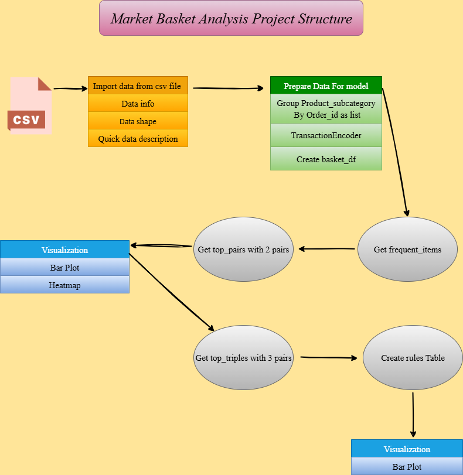

# *Market_Basket_Analysis*


## *How to run ?*

*Clone the repository:*

```bash
https://github.com/omars1234/Market_Basket_Analysis.git
```

```bash
conda create --name EnvBasketAnalysis python=3.8.2 -y
```

```bash
conda activate EnvBasketAnalysis
```

```bash
pip install -r requirements.txt
```

## *Project Structure :*




---

*1. Apriori*  
* *→ grows patterns step-by-step: 1-item → 2-item → 3-item.*

*2. Eclat*  
* *→ works by intersecting lists of transactions for speed.than Apriori if you have lots of creations.*  

*3. PyFPGrowth*   
* *→ builds a tree of items to quickly read frequent patterns.*

